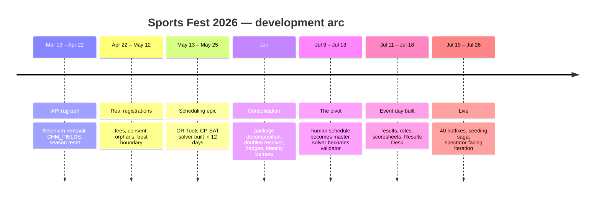

# Retrospective — Sports Fest 2026

*Written 2026-07-27, two days after the event closed. A narrative account of
what happened to this codebase between March 13 and July 27, 2026, assembled
from 544 commits, 191 issues, and the release history. Companion to
`ARCHITECTURE_REVIEW_2026.md`, which records the technical state; this
document records the story.*

---

## By the numbers

| | |
|---|---|
| Commits | **544** (2026-03-13 → 2026-07-27) |
| Lines added / removed | **+109,329 / −4,914** across 196 files |
| Issues opened | **191** — 144 closed, 47 still open |
| Middleware | **v1.04 → v1.12** |
| WordPress plugin | **1.0.x → 1.1.12** (~40 releases in the final 8 days) |
| Test suite | **889 tests**, passing in mock mode with no network |

Commits by month:

| Mar | Apr | May | Jun | Jul |
|---:|---:|---:|---:|---:|
| 9 | 68 | 164 | 70 | 234 |

The shape of that curve is the story: a scramble in spring, a build-out in
May, a quiet consolidation in June, and a July that was two things at once —
a week of frantic construction followed by a week of live fire.

---

## The seven acts

---

### Act I — The ground moves (Mar 13 – Apr 22, 77 commits)

The season did not open with features. It opened with ChMeetings replacing its
API underneath us.

March and April are almost entirely repair work: authentication header casing
(#57), `get_person()` response unwrapping (#56, filed CRITICAL), pagination
rebuilt around `total_count` (#58), group add/remove methods that did not exist
in the new API yet (#59). v1.05 also cashed in a long-standing debt in the same
breath — Selenium removed from every production path, `CHM_FIELDS` introduced as
the single source for field names, approval sync moved from Excel to API.

The hard fight was **season reset** (#63): twelve commits over three days
trying to convince ChMeetings to *clear* a custom field. PUT, then PATCH, then
a three-strategy fallback, then a `--probe` diagnostic written for the sole
purpose of discovering which payload shape the server would accept. It was
documented as a known API limitation, then revisited and solved.

That episode set the working pattern for the year: when the vendor will not
cooperate, build a diagnostic and grind. The act closed cleanly with #64,
which pulled every scattered 429 retry into `_api_request()`.

**What this act was really about:** buying back the foundation before anyone
was depending on it.

---

### Act II — Real humans arrive (Apr 22 – May 12)

Registration opened and the data grew sharp edges.

Table Tennis 35+. Coed Soccer as an exhibition event. Athlete fee tiers — $30
early, $60 late — with a genuine argument over whether the deadline was
inclusive (it is; the code now says so in a comment). Orphaned Team-group
memberships pointing at people ChMeetings would return 404 for; traced to their
own bug ticket #20188 and coded around rather than waited on.

And then #78, which deserves to be named separately. A church rep could flip a
non-member's status to *member* and slip them past pastoral approval. The fix
was not a validation patch — it was a **membership freeze**: status is captured
at approval time and cannot be edited retroactively. That is a trust boundary,
not a bug fix, and it is the first place this system stopped assuming everyone
using it was acting in good faith.

**What this act was really about:** discovering that the adversary model
includes friendly users.

---

### Act III — The scheduling epic (May 13 – May 25, 164 commits in May)

The most ambitious thing built all year, and it happened in roughly twelve days.

The progression: a Court-Schedule-Sketch tab, then a Pod-Resource-Estimate, then
an OR-Tools proof of concept (#90), then a hardened `schedule_input.json`
contract (#87, #96), then a real CP-SAT solver (#93), then an Excel renderer
(#94).

Then two weeks of constraint archaeology — the unglamorous part nobody plans
for:

- minimum rest falsely spanning midnight into the next day
- playoff slots pinned to Weekend 2, then pinned by venue + date + time
- a Layer-2 greedy gym-mode allocator sitting between venues and the solver
- cross-pool conflict avoidance (C3x) to stop athletes double-booked across sports
- QF → Semi precedence, then a rest gap between them
- a six-tier objective function
- conflict cells rendered yellow-on-red in the Master Schedule, with notes forced visible

By late May there was a working constraint solver for a real tournament.

**What this act was really about:** proving it could be done. Hold that thought.

---

### Act IV — Consolidation, and the first tremors (June, 70 commits)

A quieter month, mostly load-bearing.

`schedule_workbook.py` was decomposed into a `scheduling/` package across eight
tracked steps (#152). The doubles-partner resolver was rebuilt canonical,
self-pairing-proof, and church-boundary-enforcing (#160). Athlete photo-ID
badges shipped (#77). A pre-season hardening review (#165) produced a ranked
improvement roadmap and then actually executed most of it.

But June is also where the theme that would dominate July first surfaced:
**identity drift**.

- #171 — approvals silently pointing at a profile that had been replaced
- #173 / #174 — Individual Application rows with no ChMeetings person behind them
- #175 — profiles missing photos after form-driven creation

Duplicate and merged people stopped being a nuisance and became an operational
hazard.

**What this act was really about:** the codebase getting its house in order,
while something structural started creaking.

---

### Act V — The pivot: the solver loses to the humans (Jul 9 – Jul 13)

The turn in the story, and the most important thing to carry into 2027.

Issues #190, #191, #196, #214, and #233 are all variations on a single move:
*import the coordinators' hand-built schedule workbook and treat it as the
master override.* First the manual BB/MVB/VBW matchup workbook. Then the main
schedule workbook as master allocation override. Then draft 12. Then #217 —
import approved preliminary games and publish them to WordPress by `game_key`.

**The CP-SAT solver built in May did not produce the schedule that ran the
tournament.** What ran was a spreadsheet that humans argued into existence over
weeks of meetings. The code's job quietly changed from *generating* the schedule
to *ingesting, validating, and publishing* it.

That is not a failure, and it should not be recorded as one. The validation
layer earned its keep immediately: it caught table tennis roster mismatches,
flagged preliminary imbalance, reconciled bye placeholders, and enforced the
Friday-only Orange plan (#197). Publishing by `game_key` gave every downstream
surface — scoresheets, public display, results — one shared contract.

But it is worth being honest about what happened. Six weeks of solver work
became a validator. #218 — *repair the approved preliminary schedule with
CP-SAT for fewer conflicts* — is still open. That is the road not taken, and
it is the most interesting open question in the repo.

**What this act was really about:** learning where the machine actually adds
value in a process that humans own.

---

### Act VI — Event day built in seven days (Jul 11 – Jul 18)

Epic #202 opened on July 11 with ten child issues. Essentially all of it
shipped by July 18.

- Schedule/results schema redesign and `publish-schedule` (#203)
- Coordinator accounts with schedule-driven sport authorization (#204, #237)
- Score entry: simple form, then volleyball set-based, then Bible Challenge (#241, #244)
- Public live schedule, results, and standings (#206)
- Protected scoresheet upload and archive (#205)
- Printable score sheets — basketball, volleyball, soccer, Bible Challenge (#211, #250, #254, #255)
- Results Desk status page and event archive export (#208)
- Badges hosted in WordPress uploads and written back to ChMeetings profiles (#186, #261)
- A Bible verse bank, editable in WordPress, rotating one verse per scoresheet (#292, #294)

Simultaneously — not afterward — `rest-api.php` and `admin.php` were split into
domain modules (#265, #284). Refactoring during a sprint usually goes badly.
Here the timing was deliberate: each area got decomposed immediately before it
got hammered with new work.

Then on July 18, the eve of the event, the work stopped and got written down.
Tag v1.12 cut, v1.10 and v1.11 backfilled, the CHANGELOG repaired, and
`ARCHITECTURE_REVIEW_2026.md` written — a debt register that explicitly states
*these are not fixed, and that is on purpose*, including the `uuid` line in
`requirements.txt` that would break a fresh install. Two RFCs went in the same
day, naming June's tremors as a design problem rather than a pile of bugs.

**What this act was really about:** shipping under a deadline without lying
about the cost.

---

### Act VII — Live (Jul 19 – Jul 26)

Roughly forty plugin releases in eight days, 1.0.62 through 1.1.12.

The event ran, and the code met reality:

**Rankings and tiebreaks.** Pool progress rankings for review (#321). Head-to-head
tiebreak added — with a tied group that head-to-head cannot fully order flagged
`needs_manual_tiebreak` rather than resolved by alphabetical guesswork, because
wrong output here means the wrong team advances.

**The seeding saga.** Hotfixes 1.0.96 through 1.0.99 — four consecutive
releases whose entire purpose was to make the code reproduce what the basketball
and volleyball coordinators had already computed by hand on their own
spreadsheets. Volleyball W-L counted by rally game, not match. Difficulty of
Schedule as *total opponent wins*, not opponent win percentage, not net W-L.
Bye wins inferred from uneven pool schedules, counting for opponents' DoS but
not inflating the bye team's own record.

This is Act V repeating at a smaller scale, on a shorter clock: the humans had
already decided, and the software's job was to agree with them, verifiably.

**Live-fire misses.** `MVB-` versus `VBM-` game key prefixes disagreeing across
two screens (#341). Third-place keys not matching the advancement contract
(#342). Admins working from cached pages saving into a newer schema — fixed
with a version guard that blocks the save and explains why.

**Spectator-facing iteration.** The public advancement shortcode was revised
eight times between 1.1.05 and 1.1.12 *while people were watching it*: QF rows
included, playoff scores surfaced, blank matchups shown as TBD rather than
hidden, Coed Soccer rows added, and — yesterday — an All Sports filter sharing
the same URL parameter as Current Schedule so both tables stay in sync.

**What this act was really about:** the difference between software that is
finished and software that is in use.

---

## What the year was actually about

### 1. Three parties negotiating, and the humans won the schedule

ChMeetings owns identity. The solver wanted to own time. The coordinators
actually owned it. The code found its real role as the layer that validates and
publishes human decisions — and that is where it added the most value all year.
The seeding saga in Act VII is the same lesson arriving twice.

For 2027 this is a design input, not a regret. The question is not "how do we
make the solver win next time" but "where is the human judgment, and how do we
serve it faster." #218 is the honest experiment.

### 2. Identity is the unfinished spine

It appeared in June as bugs. It got named in July as epic #307 — *Identity &
Registrant Trust* — with two RFCs (`CANONICAL_IDENTITY_RFC.md`,
`REGISTRANT_TRUST_RFC.md`) and eleven open issues covering canonical IDs, alias
maps, merge tolerance, duplicate detection, minor consent, guardian links, and
contact verification.

This is the single largest thing 2027 inherits, and it is the only area where
the system currently produces *silently wrong* output rather than errors.

### 3. The debt was written down, not pretended away

Most projects reach an event and either ignore accumulated debt or panic-fix it
in the last week. The July 18 review did neither — it inventoried the debt,
justified deferring it, and shipped. The `uuid` package that breaks fresh
installs is documented at `requirements.txt:14` with an explanation of why it
went unnoticed and why it was left alone.

### 4. Warn and continue, don't halt

The operating philosophy that held all season: error counts are normal in this
domain, and a nightly pipeline that halts on them is worse than one that reports
them. Fail-fast gates were proposed and rejected. Every hardening change this
year — orphan handling, null-field export, read-failure classification (#331) —
followed the same rule: distinguish *failed* from *empty*, log it, keep going.

### 5. Refactoring was survival, not vanity

`church_teams_export` → `schedule_workbook` → `scheduling/` package.
`rest-api.php` → domain controllers. `admin.php` → page-owned modules.
`results-desk.php` → focused modules. Every one of these landed immediately
before that area absorbed a large amount of new work. That was not luck.

---

## What 2027 inherits

**47 issues are open, 43 of them opened in July.** Three were filed in the last
72 hours. The system finished the event already asking for next year.

**The epics:**

| Epic | Scope |
|---|---|
| #307 | Identity & Registrant Trust — canonical IDs, roles, verified registrants, minor consent |
| #272 | 2027 Scheduling Helper (GUI) — seven open spikes, full PRD written |
| #202 | *Closed.* Event-day results — shipped and battle-tested |

**Filed in the final week, straight out of running the event:**

- #347 — standardize team-sport playoff seeding and tiebreak rules (the seeding saga, generalized)
- #350 — capture inviter and discipleship stage on the Individual Application
- #351 — gate all ChMeetings person creation behind identity resolution
- #353 — revise player eligibility categories for members and non-member Christians
- #354 — complete Sports Fest archival package export
- #325 — capture Track & Field sub-event signups before publication (a blocker hit live)

**The quick wins waiting in the debt register:** the `uuid` line, the literal
ChMeetings field strings bypassing `CHM_FIELDS`, PHP lint and REST test coverage
(#332).

---

## Closing note

Two seasons in, the three-tier architecture held. Nothing this year required
breaking the boundary between ChMeetings, the middleware, and WordPress —
scheduling, badges, scoresheets, insurance intake, and event-day results all
found homes inside the existing shape.

What changed is the system's understanding of its own job. It started 2026 as a
registration and approval bridge. It ended 2026 as the thing that validates and
publishes what a few hundred people decided together, in time for them to read
it on a phone in a gym.

That is a better job than the one it set out to do.
