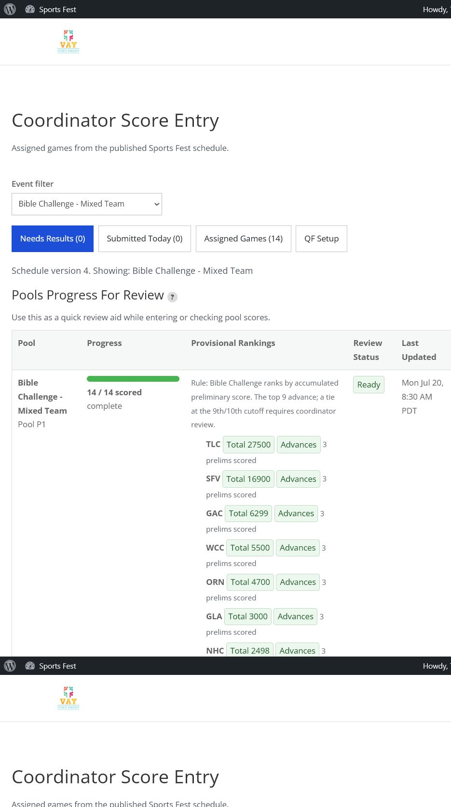
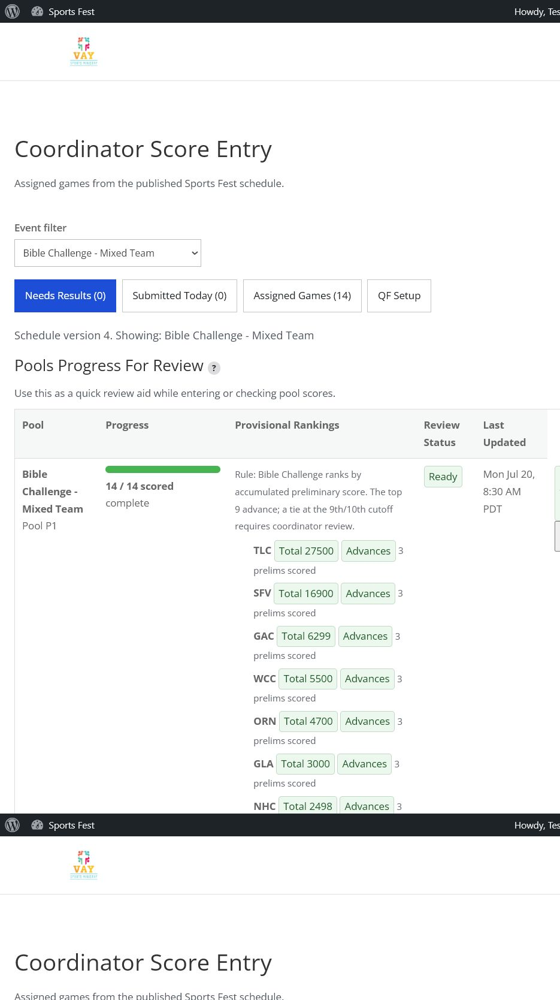
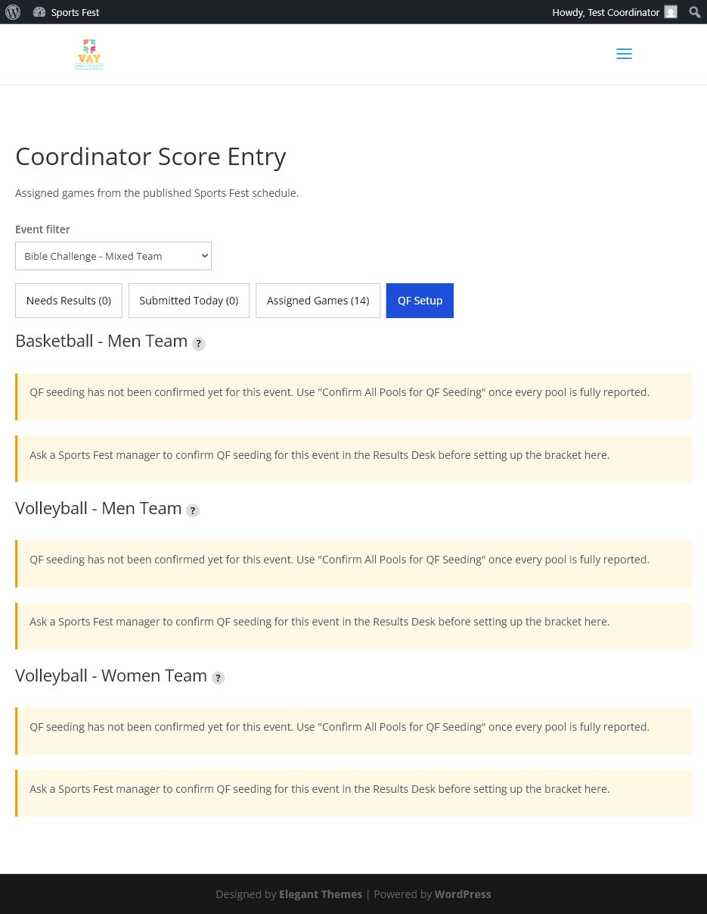

# Coordinator Self-Service Walkthrough: Pool Review & QF Setup

This is a verification record, not a design doc: live-staging walkthroughs on
2026-07-22 covering plugin upgrades from 1.0.71 through 1.0.93. The goal is
that a Sports Fest coordinator, not just a Results Desk manager, can review
their event's pools, confirm advancement/QF seeding, preview the bracket,
reorder matchups, and apply QF schedule rows end-to-end from the Coordinator
Score Entry dashboard.

See issue [#335](https://github.com/i12know/vaysf/issues/335) for the bug list
this pass produced, and `docs/SCHEDULING.md` for how the underlying
schedule/results data model works.

Screenshots below are from the fresh staging site at
`/staging/8463/coordinator-score-entry/`, logged in as `test_coordinator`.

## Who This Is For

Four coordinator personas were tested, each authorized via
`sf2025_submit_results` plus per-event authorization, not Results Desk access:

- Bible Challenge coordinator
- Basketball-Men coordinator
- Volleyball-Men coordinator
- Volleyball-Women coordinator

## Coordinator-Owned Advancement

Coordinators must not need a manager/admin to complete the event-day review job
for their assigned events. As of 1.0.93:

- Bible Challenge coordinators can confirm/re-confirm the Top 9 directly from
  the Pools Progress For Review table.
- Basketball/Volleyball coordinators can review cross-pool rankings, resolve
  coin-toss ties, and confirm/re-confirm QF seeding directly from the QF Setup
  tab for their assigned events.
- Results Desk users can still perform the same QF-seeding actions across all
  events, but coordinator accounts are scoped to their own authorized events.

## Walkthrough: Bible Challenge Coordinator

1. Coordinator opens Coordinator Score Entry and filters to
   `Bible Challenge - Mixed Team`.
2. The Pools Progress For Review table shows the pool's 14/14 scored games,
   the Top-9-by-cumulative-score ranking, and Review Status of Ready.
3. If advancement was already confirmed, the row shows who confirmed it plus a
   Re-confirm Top 9 button; otherwise it shows Confirm Top 9.
4. Clicking the button confirms/re-confirms the pool's advancement as the
   coordinator account, with no Results Desk access required.
5. Confirmed outcome: the page redirects back to the same dashboard with a
   success message, not a 404.

## Walkthrough: Basketball / Volleyball Coordinator

1. Coordinator opens Coordinator Score Entry -> QF Setup.
2. Every Basketball/Volleyball event the coordinator is authorized for appears
   on the one QF Setup page, not just the currently filtered event.
3. If QF seeding has not been confirmed yet, the coordinator reviews the
   cross-pool QF seeding panel for that event, resolves any required coin-toss
   tie-breaks, and clicks Confirm All Pools for QF Seeding.
4. Each confirmed event shows a bracket editor: Slot A / Slot B dropdowns for
   QF-1..4, pre-filled with the standard 1-vs-8 / 4-vs-5 / 3-vs-6 / 2-vs-7
   seeding from the confirmed Top 8, plus a live preview table.
5. Coordinator may reorder any slot via the dropdowns and click Update preview
   to see the custom arrangement reflected before committing.
6. Clicking Apply QF matchup to schedule writes the arrangement into the
   `<PREFIX>-QF-1..4` schedule rows, creating them if missing, and prewires
   Semifinal/Final/3rd-Place rows with winner/loser placeholders. Rows already
   reported/official/under-review are left untouched.

## Fresh-Staging Regression Caught Before 1.0.93

On the staging site restored from 1.0.71 data and upgraded to 1.0.92, the
coordinator could reach QF Setup but could not continue when QF seeding had not
already been confirmed by a manager. This was the remaining design gap:

1.0.93 fixes that gap by rendering the cross-pool QF seeding/coin-toss panel
inside the coordinator QF Setup section and by allowing the corresponding
admin-post handlers for either Results Desk users or coordinators assigned to
that exact event. After 1.0.93 is activated on staging, the final BB/VB success
screenshots should be recaptured from the same QF Setup page.

## Bugs Found And Fixed During This Pass

All six were found by actually clicking through the coordinator flow live on
staging, not by code review. They are detailed in the CHANGELOG entries for
1.0.89 through 1.0.93:

1. Pool-review confirm 403'd for every coordinator. Fixed with
   `vaysf_user_can_confirm_pool_review()`.
2. Coin toss could never actually be recorded because `sf_coin_toss_flip.call`
   used an unquoted reserved MySQL keyword. Renamed to `call_side`.
3. A fatal PHP parse error was caught before activation: the #333 file split
   had dropped a docblock opener in `playoff-preview.php`.
4. Coordinator dashboard returned to a doubled staging URL and 404'd after a
   successful confirm. Fixed by reusing `vaysf_results_desk_current_request_url()`.
5. Reordering one event's QF bracket made unrelated events on the same QF Setup
   page falsely report incomplete QF rows. Fixed by filtering `qf_seed` keys to
   the current event prefix before validation.
6. Fresh staging still required a manager for BB/VB QF seeding. Fixed in
   1.0.93 by moving seeding review, coin tosses, and QF-seeding confirmation
   into the coordinator's assigned-event QF Setup panel.

## Result

As of plugin 1.0.93, the intended coordinator workflow is self-service for
Bible Challenge, Basketball-Men, Volleyball-Men, and Volleyball-Women: pool
review, QF seeding confirmation, tie resolution, preview/reorder, and Apply all
live on the Coordinator Score Entry dashboard for assigned events.

The fresh staging site used for the screenshots was still running 1.0.92 when
the BB/VB blocker was discovered. Activate the 1.0.93 package, then re-run the
BB/VB portion above to capture the final success screenshots.
