# Coordinator Self-Service Walkthrough: Pool Review & QF Setup

This is a verification record, not a design doc: live-staging walkthroughs on
2026-07-22 covering plugin upgrades from 1.0.71 through 1.0.95. The goal is
that a Sports Fest coordinator, not just a Results Desk manager, can review
their event's pools, confirm advancement/QF seeding, preview the bracket,
reorder matchups, and apply QF schedule rows end-to-end from the Coordinator
Score Entry dashboard.

See issue [#335](https://github.com/i12know/vaysf/issues/335) for the bug list
this pass produced, and `docs/SCHEDULING.md` for how the underlying
schedule/results data model works.

Screenshots below are from fresh staging clones restored from 1.0.71 data. The
final acceptance run used plugin 1.0.95 on
`/staging/3552/coordinator-score-entry/`, logged in as `test_coordinator`.

## Who This Is For

Four coordinator personas were tested, each authorized via
`sf2025_submit_results` plus per-event authorization, not Results Desk access:

- Bible Challenge coordinator
- Basketball-Men coordinator
- Volleyball-Men coordinator
- Volleyball-Women coordinator

## Coordinator-Owned Advancement

Coordinators must not need a manager/admin to complete the event-day review job
for their assigned events. As of 1.0.95:

- Bible Challenge coordinators can confirm/re-confirm the Top 9 directly from
  the Pools Progress For Review table.
- Basketball/Volleyball coordinators can review cross-pool rankings, resolve
  coin-toss ties, and confirm/re-confirm QF seeding directly from the QF Setup
  tab for their assigned events.
- Results Desk users can still perform the same QF-seeding actions across all
  events, but coordinator accounts are scoped to their own authorized events.

## Walkthrough: Bible Challenge Coordinator

1. Coordinator opens Coordinator Score Entry and filters to
   `Bible Challenge - Mixed Team`.
2. The Pools Progress For Review table shows the pool's 14/14 scored games,
   the Top-9-by-cumulative-score ranking, and Review Status of Ready.
3. If advancement was already confirmed, the row shows who confirmed it plus a
   Re-confirm Top 9 button; otherwise it shows Confirm Top 9.
4. Clicking the button confirms/re-confirms the pool's advancement as the
   coordinator account, with no Results Desk access required.
5. Confirmed outcome: the page redirects back to the same dashboard with a
   success message, not a 404.

The final 1.0.95 acceptance run on `/staging/3552/` re-confirmed the same flow
from the freshly cloned site. The row changed from the prior manager
confirmation to Confirmed by Test Coordinator after the coordinator submitted
Re-confirm Top 9.

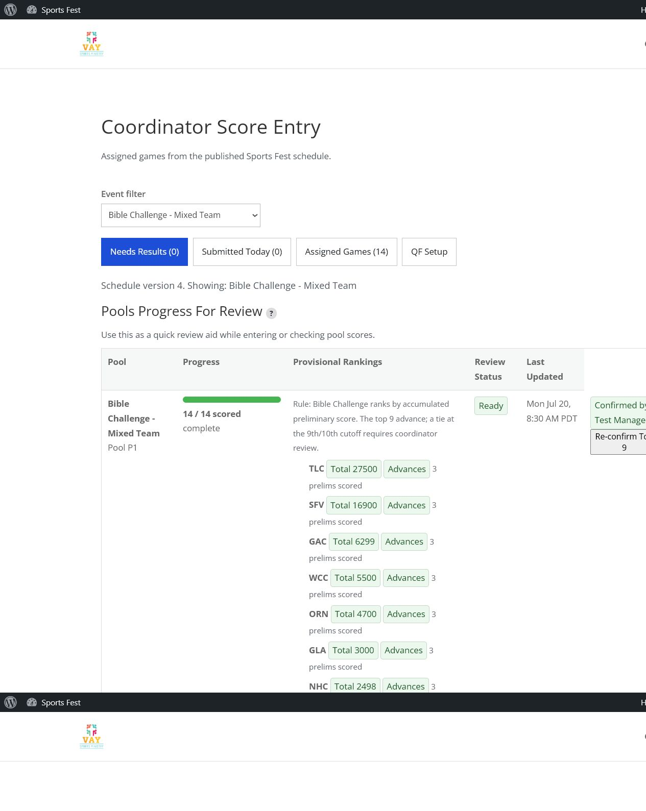

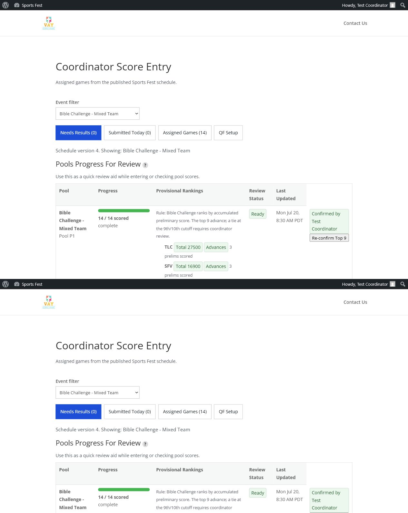

## Walkthrough: Basketball / Volleyball Coordinator

1. Coordinator opens Coordinator Score Entry -> QF Setup.
2. Every Basketball/Volleyball event the coordinator is authorized for appears
   on the one QF Setup page, not just the currently filtered event.
3. If QF seeding has not been confirmed yet, the coordinator reviews the
   cross-pool QF seeding panel for that event, resolves any required coin-toss
   tie-breaks, and clicks Confirm All Pools for QF Seeding.
4. Each confirmed event shows a bracket editor: Slot A / Slot B dropdowns for
   QF-1..4, pre-filled with the standard 1-vs-8 / 4-vs-5 / 3-vs-6 / 2-vs-7
   seeding from the confirmed Top 8, plus a live preview table.
5. Coordinator may reorder any slot via the dropdowns and click Update preview
   to see the custom arrangement reflected before committing.
6. Clicking Apply QF matchup to schedule writes the arrangement into the
   `<PREFIX>-QF-1..4` schedule rows, creating them if missing, and prewires
   Semifinal/Final/3rd-Place rows with winner/loser placeholders. Rows already
   reported/official/under-review are left untouched.

The final 1.0.95 acceptance run on `/staging/3552/` verified Basketball-Men
end-to-end. The coordinator confirmed QF seeding, previewed the default
matchups, applied the schedule rows, and verified the created rows:

- BBM-QF-1: Seed 1 OCB vs Seed 8 TLC
- BBM-QF-2: Seed 4 GAC vs Seed 5 GLA
- BBM-QF-3: Seed 3 ORN vs Seed 6 ANH
- BBM-QF-4: Seed 2 RPC vs Seed 7 FVC
- Semifinal, Final, and 3rd-Place rows were created as winner/loser
  placeholders.

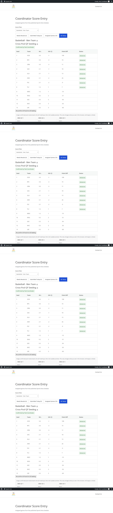

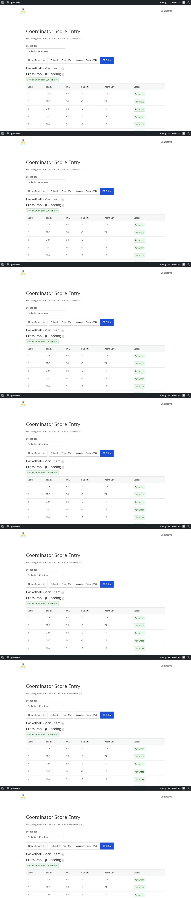

The final 1.0.95 acceptance run also verified Volleyball-Men end-to-end. This
was the most important recovery case because the same staging clone already had
one recorded coin toss from the earlier stuck 1.0.94 run. After 1.0.95
activated, the already-recorded pair disappeared, only the remaining seed-order
tosses were visible, and the coordinator completed the workflow without manager
or admin help:

- VBM-QF-1: Seed 1 MWC vs Seed 8 FVC
- VBM-QF-2: Seed 4 NSD vs Seed 5 TLC
- VBM-QF-3: Seed 3 SFV vs Seed 6 ANH
- VBM-QF-4: Seed 2 RPC vs Seed 7 GAC
- Semifinal, Final, and 3rd-Place rows were created as winner/loser
  placeholders.

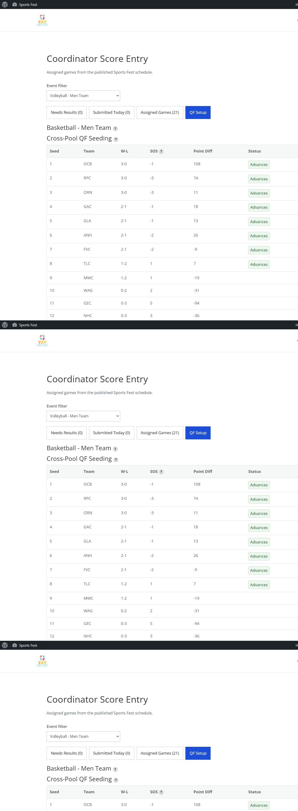

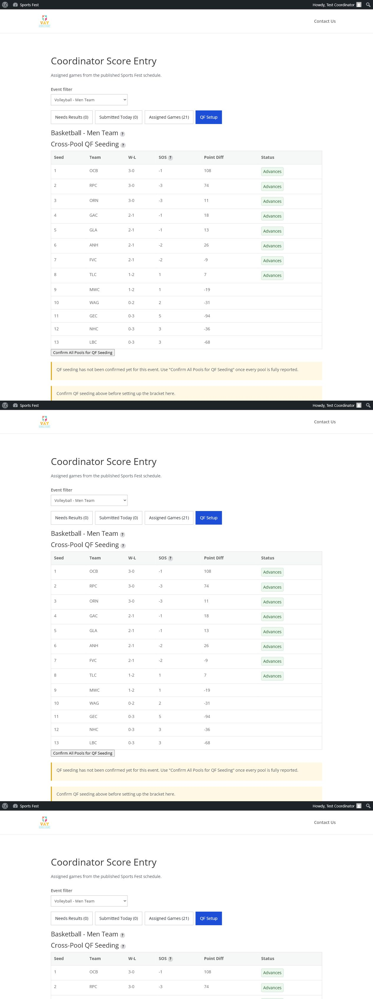

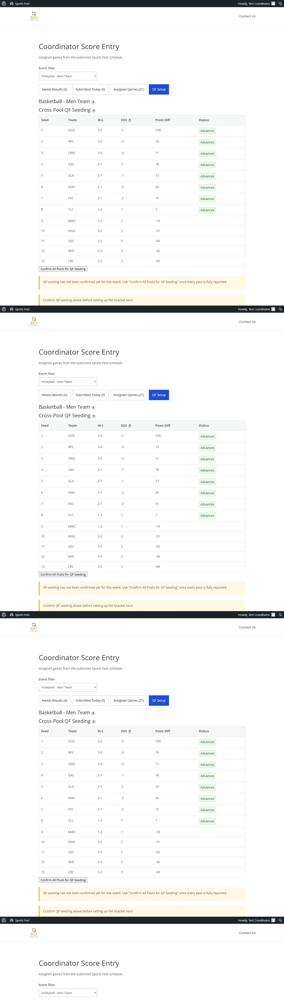

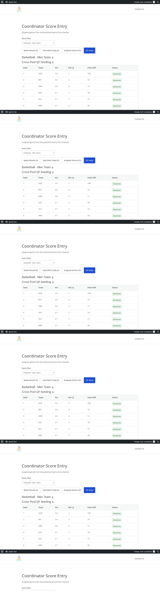

The final 1.0.95 acceptance run verified Volleyball-Women end-to-end as well:

- VBW-QF-1: Seed 1 MWC vs Seed 8 ORN
- VBW-QF-2: Seed 4 FVC vs Seed 5 RPC
- VBW-QF-3: Seed 3 NSD vs Seed 6 GAC
- VBW-QF-4: Seed 2 ANH vs Seed 7 NHC
- Semifinal, Final, and 3rd-Place rows were created as winner/loser
  placeholders.

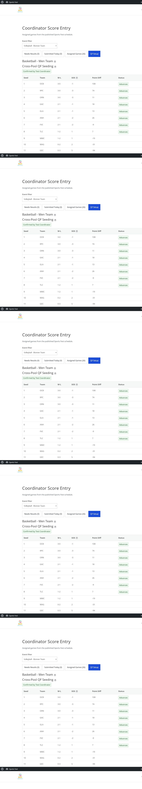

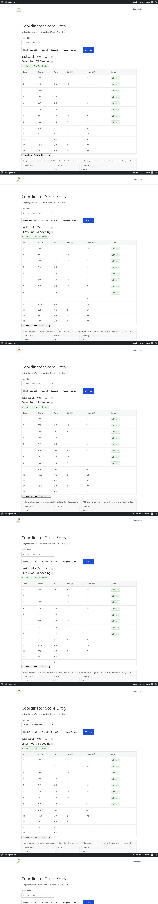

## Fresh-Staging Regressions Caught Before 1.0.95

On the staging site restored from 1.0.71 data and upgraded to 1.0.92, the
coordinator could reach QF Setup but could not continue when QF seeding had not
already been confirmed by a manager. This was the remaining design gap:

1.0.93 fixed that gap by rendering the cross-pool QF seeding/coin-toss panel
inside the coordinator QF Setup section and by allowing the corresponding
admin-post handlers for either Results Desk users or coordinators assigned to
that exact event.

Volleyball-Men exposed one more live blocker on 1.0.93: its Top 8 QF seeds
were already stable, but unresolved coin-toss groups entirely below the
advancing cutoff still rendered Flip coin forms and blocked QF confirmation.
The first flip recorded successfully; repeated submits then returned "This
pair already has a recorded coin-toss decision" while the same lower-table
forms remained visible.

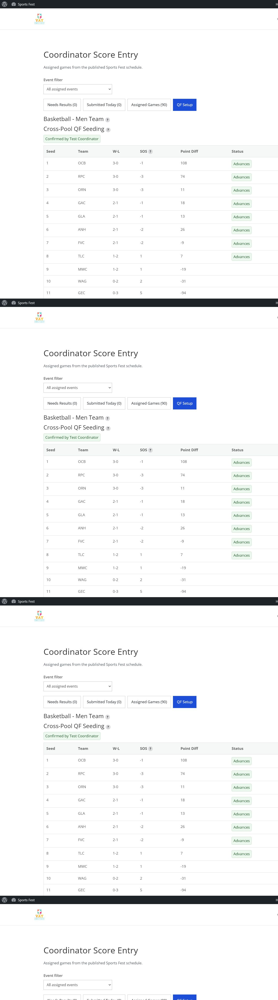

Hotfix 1.0.94 fixed that case by requiring coin-toss resolution only for
unresolved groups touching seed slots 1-8. Lower-table unresolved ties stay
visible as diagnostics but no longer block the coordinator from confirming the
Top 8 and setting up QF rows. A follow-up 1.0.95 fix hid already-recorded
coin-toss pairs so coordinators are not invited to re-submit a pair that the
backend will correctly reject.

## Bugs Found And Fixed During This Pass

All eight were found by actually clicking through the coordinator flow live on
staging, not by code review. They are detailed in the CHANGELOG entries for
1.0.89 through 1.0.95:

1. Pool-review confirm 403'd for every coordinator. Fixed with
   `vaysf_user_can_confirm_pool_review()`.
2. Coin toss could never actually be recorded because `sf_coin_toss_flip.call`
   used an unquoted reserved MySQL keyword. Renamed to `call_side`.
3. A fatal PHP parse error was caught before activation: the #333 file split
   had dropped a docblock opener in `playoff-preview.php`.
4. Coordinator dashboard returned to a doubled staging URL and 404'd after a
   successful confirm. Fixed by reusing `vaysf_results_desk_current_request_url()`.
5. Reordering one event's QF bracket made unrelated events on the same QF Setup
   page falsely report incomplete QF rows. Fixed by filtering `qf_seed` keys to
   the current event prefix before validation.
6. Fresh staging still required a manager for BB/VB QF seeding. Fixed in
   1.0.93 by moving seeding review, coin tosses, and QF-seeding confirmation
   into the coordinator's assigned-event QF Setup panel.
7. Volleyball-Men QF setup was blocked by unresolved lower-table ties even
   though the Top 8 QF seeds were stable. Fixed in 1.0.94 by checking only
   unresolved groups that touch seeds 1-8 before enabling QF confirmation.
8. Volleyball-Men still showed already-recorded coin-toss pairs after a
   partial run. Fixed in 1.0.95 by hiding recorded pairs and leaving only
   still-needed flips visible.

## Result

As of plugin 1.0.95, the verified coordinator workflow is self-service for
Bible Challenge, Basketball-Men, Volleyball-Men, and Volleyball-Women on the
fresh staging clone: pool review, advancement/QF seeding confirmation,
coin-toss resolution where needed, preview/reorder, and schedule setup all live
on the Coordinator Score Entry dashboard for assigned events.
