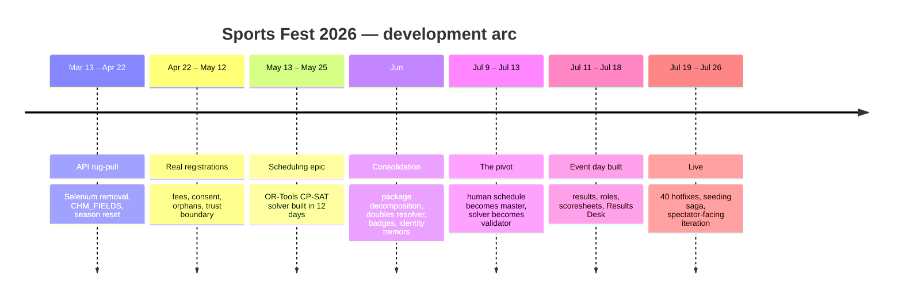

# Retrospective — Sports Fest 2026

*Written 2026-07-27, two days after the event closed. A narrative account of
what happened to this codebase between March 13 and July 27, 2026, assembled
from 544 commits, 191 issues, and the release history. Drafted by Claude;
reviewed and approved manually by Bumble.*

*This is the canonical season record. Two companion documents sit beside it:
`ARCHITECTURE_REVIEW_2026.md` records the technical state at tag v1.12, and
`RETROSPECTIVE_2026_COMPANION.md` is an independent reflection on the same
season written the same morning. Where this document supplies the chronology and
the evidence, that one supplies interpretation — several of its findings are
incorporated below and marked where the operational knowledge came from it
rather than from the commit history. See `RETROSPECTIVES.md` for the full series
and reading order; `RETROSPECTIVE_2025.md` and `RETROSPECTIVE_PODIO_2016_2024.md`
cover the years before this one.*

---

## By the numbers

| | |
|---|---|
| Commits | **544** (2026-03-13 → 2026-07-27) |
| Lines added / removed | **+109,329 / −4,914** across 196 files |
| Issues opened | **191** — 144 closed, 47 still open |
| Middleware | **v1.04 → v1.12** |
| WordPress plugin | **1.0.x → 1.1.12** (~40 releases in the final 8 days) |
| Test suite | **889 tests**, passing in mock mode with no network |

Commits by month:

| Mar | Apr | May | Jun | Jul |
|---:|---:|---:|---:|---:|
| 9 | 68 | 164 | 70 | 234 |

The shape of that curve is the story: a scramble in spring, a build-out in
May, a quiet consolidation in June, and a July that was two things at once —
a week of frantic construction followed by a week of live fire.

---

## The seven acts

---

### Act I — The ground moves (Mar 13 – Apr 22, 77 commits)

The season did not open with features. It opened with ChMeetings replacing its
API underneath us. (This is not bad, but the evidence of a growing product, the
reason why we moved our platform from Podio to ChMeetings as system of record.)

March and April are almost entirely repair work: authentication header casing
(#57), `get_person()` response unwrapping (#56, filed CRITICAL), pagination
rebuilt around `total_count` (#58), group add/remove methods that did not exist
in the new API yet (#59). v1.05 also cashed in a long-standing debt in the same
breath — Selenium removed from every production path, `CHM_FIELDS` introduced as
the single source for field names, approval sync moved from Excel to API.

The hard fight was **season reset** (#63): twelve commits over three days
trying to convince ChMeetings to *clear* a custom field. PUT, then PATCH, then
a three-strategy fallback, then a `--probe` diagnostic written for the sole
purpose of discovering which payload shape the server would accept. It was
documented as a known API limitation, then revisited and solved. (This is
significant if we want to track participants' records over the years for
discipleship purposes.)

That episode set the working pattern for the year: when the vendor will not
cooperate, build a diagnostic and grind. The act closed cleanly with #64,
which pulled every scattered 429 retry into `_api_request()`.

The deeper win was one of posture. API failures, 404s, 429s, and malformed
payloads became things the system could *observe and handle* rather than
mysteries that surfaced later as a broken spreadsheet. The parts of the
operation that staff most depend on became boring.

**What this act was really about:** buying back the foundation before anyone
was depending on it. (This should always be pre-seasonal API/vendors-dependecies 
checks.)

---

### Act II — Real humans arrive (Apr 22 – May 12)

Registration opened, and the data grew sharp edges.

Table Tennis 35+. Coed Soccer as an exhibition event. Athlete fee tiers — $30
early, $60 late — with a genuine argument over whether the deadline was
inclusive (it is; the code now says so in a comment). Orphaned Team-group
memberships pointing at people ChMeetings would return 404 for; traced to their
own bug ticket #20188 and coded around rather than waited on. (And ChMeetings
was super responsive in resolving these types of issues within the week.)

This phase looked unglamorous next to scheduling or live scoring, and it was
not. It exposed how many operational assumptions hide in small corners:
whether a deadline includes its last day, whether a ChMeetings option ID is
current, whether a form row maps to a real Person, whether an export row
reflects this season or old tenant residue. The Church Team export stopped
being a report and became a **diagnostic instrument** — it tells staff where
the data is trustworthy, where it is stale, and where a human still has to look.

For Sports Fest, data cleanup is not administrative overhead. It is event
preparation.

And then #78, which deserves to be named separately. A church rep could flip a
non-member's status to *member* and slip them past pastoral approval. The fix
was not a validation patch — it was a **membership freeze**: status is captured
at approval time and cannot be edited retroactively. That is a trust boundary,
not a bug fix, and it is the first place this system stopped assuming everyone
using it was acting in good faith.

**What this act was really about:** discovering that the adversary model
includes friendly users.

---

### Act III — The scheduling epic (May 13 – May 25, 164 commits in May)

The most ambitious thing built all year, and it happened in roughly twelve days.

(For the uninitiated, Sports Fest scheduling is a large-scale constraint
optimization problem: thousands of interconnected requirements involving
venues, time slots, teams, athletes, officials, rest periods, conflicts, and
fairness must be reconciled simultaneously. The number of possible schedules
grows explosively as games and constraints are added, placing the problem in
the NP-hard family of combinatorial optimization problems. Rather than relying
only on handcrafted scheduling rules, the system used 
[Google's OR-Tools](https://github.com/google/or-tools)
CP-SAT solver to search this enormous solution space for schedules that
satisfied the hard constraints while optimizing competing goals such as
fairness, rest time, travel, and facility utilization.)

The progression: a Court-Schedule-Sketch tab, then a Pod-Resource-Estimate, then
an OR-Tools proof of concept (#90), then a hardened `schedule_input.json`
contract (#87, #96), then a real CP-SAT solver (#93), then an Excel renderer
(#94).

Then two weeks of constraint archaeology — the unglamorous part nobody plans
for:

- minimum rest falsely spanning midnight into the next day
- playoff slots pinned to Weekend 2, then pinned by venue + date + time
- a Layer-2 greedy gym-mode allocator sitting between venues and the solver
- cross-pool conflict avoidance (C3x) to stop athletes double-booked across sports
- QF → Semi precedence, then a rest gap between them
- a six-tier objective function
- conflict cells rendered yellow-on-red in the Master Schedule, with notes forced visible

By late May there was a working constraint solver for a real tournament.

What the season proved is that Sports Fest scheduling is not "place games into
slots." It is a negotiation between registration demand, venue geometry,
sport-specific formats, shared-athlete conflicts, church constraints,
coordinator preferences, leadership events, meals, ceremonies, setup and
teardown — and a human scheduler's final authority.

**What this act was really about:** proving it could be done. Hold that thought.

---

### Act IV — Consolidation, and the first tremors (June, 70 commits)

A quieter month, mostly load-bearing.

`schedule_workbook.py` was decomposed into a `scheduling/` package across eight
tracked steps (#152). The doubles-partner resolver was rebuilt canonical,
self-pairing-proof, and church-boundary-enforcing (#160). Athlete photo-ID
badges shipped (#77). A pre-season hardening review (#165) produced a ranked
improvement roadmap and then actually executed most of it.

But June is also where the theme that would dominate July first surfaced:
**identity drift**.

- #171 — approvals silently pointing at a profile that had been replaced
- #173 / #174 — Individual Application rows with no ChMeetings person behind them
- #175 — profiles missing photos after form-driven creation

Duplicate and merged people stopped being a nuisance and became an operational
hazard. A participant, it turned out, is not just a row. People registered for
themselves and for their children, through different forms, under different
spellings, with church affiliations that changed and consent states that could
be invalidated by an edit made weeks later.

**What this act was really about:** the codebase getting its house in order,
while something structural started creaking.

---

### Act V — The pivot: the solver loses to the humans (Jul 9 – Jul 13)

The turn in the story, and the most important thing to carry into 2027.

Issues #190, #191, #196, #214, and #233 are all variations on a single move:
*Import the coordinators' hand-built schedule workbook and treat it as the
master override.* First the manual BB/MVB/VBW matchup workbook. Then the main
schedule workbook as master allocation override. Then draft 12. Then #217 —
import approved preliminary games and publish them to WordPress by `game_key`.

**The CP-SAT solver built in May did not produce the schedule that ran the
tournament.** What ran was a spreadsheet that humans collaborated into existence
over meetings and emails. The code's job quietly changed from *generating* the 
schedule to *ingesting, validating, and publishing* it.

That is not a failure, and it should not be recorded as one. The validation
layer earned its keep immediately: it caught table tennis roster mismatches,
flagged preliminary imbalance, reconciled bye placeholders, and enforced the
Friday-only Orange plan (#197). Publishing by `game_key` gave every downstream
surface — scoresheets, public display, results — one shared contract.

But the diagnosis underneath is sharper than "the humans won," and it is the
best single explanation of the 2026 scheduling experience:

> **The engine improved faster than the cockpit.**

The solver got better all season. The operator's interface to it never did. The
authoritative schedule was ultimately assembled from generated workbooks, manual
Excel edits, coordinator PDFs, importer audits, sidecar JSON, and rerun chains
that had to be executed in the right order from memory. Human authority was
never the problem. The problem was that human decisions arrived as **forensic
clues in colored cells** instead of as typed data the system could reason about.

This is why the 2027 Scheduling Helper (#272, full PRD written) is not an
indulgent GUI idea. It is the direct conclusion of Act III and Act V: build a
structured authoring surface where humans stay authoritative, but their decisions
become data on the way in, not archaeology on the way out.

Six weeks of solver work became a validator. #218 — *repair the approved
preliminary schedule with CP-SAT for fewer conflicts* — is still open. That is
the road not taken, and it is the most interesting open question in the repo.

**What this act was really about:** learning that automation can assist complex
scheduling only when the human decisions are captured in a structure the system
can understand.

---

### Act VI — Event day built in seven days (Jul 11 – Jul 18)

Epic #202 opened on July 11 with ten child issues. Essentially all of it
shipped by July 18.

- Schedule/results schema redesign and `publish-schedule` (#203)
- Coordinator accounts with schedule-driven sport authorization (#204, #237)
- Score entry: simple form, then volleyball set-based, then Bible Challenge (#241, #244)
- Public live schedule, results, and standings (#206)
- Protected scoresheet upload and archive (#205)
- Printable score sheets — basketball, volleyball, soccer, Bible Challenge (#211, #250, #254, #255)
- Results Desk status page and event archive export (#208)
- Badges hosted in WordPress uploads and written back to ChMeetings profiles (#186, #261)
- A Bible verse bank, editable in WordPress, rotating one verse per scoresheet (#292, #294)

This is the act where the center of gravity moved. ChMeetings remained the
source of registration truth and the middleware remained the orchestrator, but
**WordPress became the live operations board** — what is scheduled, what is
scored, what is missing, what is public, what needs review, what can advance.

Simultaneously — not afterward — `rest-api.php` and `admin.php` were split into
domain modules (#265, #284). Refactoring during a sprint usually goes badly.
Here the timing was deliberate: each area got decomposed immediately before it
got hammered with new work.

Then on July 18, the eve of the event, the work stopped and got written down.
Tag v1.12 cut, v1.10 and v1.11 backfilled, the CHANGELOG repaired, and
[ARCHITECTURE_REVIEW_2026.md](ARCHITECTURE_REVIEW_2026.md) written — a debt register that 
explicitly states *these are not fixed, and that is on purpose*, including the `uuid` line
in `requirements.txt` that would break a fresh install. Two RFCs went in the same
day, naming June's tremors as a design problem rather than a pile of bugs.

**What this act was really about:** shipping under a deadline without lying
about the cost.

---

### Act VII — Live (Jul 19 – Jul 26)

Roughly forty plugin releases in eight days, 1.0.62 through 1.1.12.

**Rankings and tiebreaks.** Pool progress rankings for review (#321).
Head-to-head tiebreak added — with a tied group that head-to-head cannot fully
order, flagged `needs_manual_tiebreak` rather than resolved by alphabetical
guesswork, because wrong output here means the wrong team advances.

**The seeding saga.** Hotfixes 1.0.96 through 1.0.99 — four consecutive
releases whose entire purpose was to make the code reproduce what the basketball
and volleyball coordinators had already computed by hand on their own
spreadsheets. Volleyball W-L counted by rally game, not match. Difficulty of
Schedule as *total opponent wins*, not opponent win percentage, not net W-L.
Bye wins inferred from uneven pool schedules, counting for opponents' DoS but
not inflating the bye team's own record.

These were not random hotfixes. They were the system learning the tournament's
real rules under time pressure — and discovering that those rules lived in a
coordinator's spreadsheet and a handbook interpretation, not in any written
specification the code could have been built against.

**Live-fire misses.** `MVB-` versus `VBM-` game key prefixes disagreeing across
two screens (#341). Third-place keys not matching the advancement contract
(#342). Admins working from cached pages saving into a newer schema — fixed
with a version guard that blocks the save and explains why (1.1.04).

That last one generalizes. Stale admin pages, ambiguous buttons, and hidden
state are not cosmetic problems during an event; they are how a coordinator
records the wrong result. **Event-day UI state, permissions, cache behavior, and
recovery paths are operational safety features, not polish.** The no-cache
headers and version guards shipped mid-event are the clearest evidence the
system learned this the hard way.

**Spectator-facing iteration.** The public advancement shortcode was revised
eight times between 1.1.05 and 1.1.12 *while people were watching it*: QF rows
included, playoff scores surfaced, blank matchups shown as TBD rather than
hidden, Coed Soccer rows added, and — on July 27 — an All Sports filter sharing
the same URL parameter as Current Schedule so both tables stay in sync.

#### The Track & Field boundary

The most instructive thing that happened during the event is something the
commit log alone does not show.

The code shipped final-placement plumbing for Track & Field and Tug-of-War
(#209). But Track & Field never became a first-class digital workflow, and
#325 — *capture Track & Field sub-event signups before schedule/results
publication* — was filed mid-event as a blocker and remains open.

The reason is not that the feature was unfinished. It is that **the upstream
source of truth did not exist.** Most actual Track & Field participation
happened on site or on paper; only a small fraction arrived through the online
form. Without structured sub-event signup captured *before* event day, the
system cannot responsibly generate start lists, heats, lanes, schedules, or
automated result rows — and generating them anyway would have produced
confident, wrong output.

This is the cleanest lesson of the season, and it generalizes past Track &
Field: **automation only works where the source of truth exists.** Where the
source is structured, the system can help. Where the source is paper, memory,
or hallway coordination, the honest move is to stay manual and solve intake
first.

*(This finding comes from operational knowledge of how the event actually ran,
recorded in `RETROSPECTIVE_2026_COMPANION.md`, not from the repository history.)*

**What this act was really about:** the difference between software that is
finished and software that is in use.

---

## What held

- **The three-tier architecture.** ChMeetings for registration, middleware for orchestration, WordPress for operations. Nothing this year required breaking that boundary.
- **API-first.** The Selenium removal stuck. No production sync path regressed. The one browser-automation survivor is explicitly sanctioned as a diagnostic operator tool.
- **Mock-mode testing.** 889 tests, no network, honest skips. It functioned as a real safety net through a very fast July.
- **The plugin's ability to absorb event-day responsibility** without dissolving its boundary with the middleware.
- **The scheduling pipeline's contracts.** `schedule_input.json`, `schedule_output.json`, and `game_key` remained useful even after human-authored schedules became authoritative — the artifacts outlived the solver's original role.
- **The issue tracker as operational memory.** 191 issues with real titles and real closure notes is why this retrospective could be written at all.

## What bent

- **Scheduling workflow**, under the weight of Excel handoffs, manual overrides, and artifact version tracking. The engine outran the cockpit.
- **Plugin release discipline**, under hotfix pressure. Version, zip, changelog, and tag discipline all had to be repaired after the fact on July 18.
- **Identity assumptions**, once ChMeetings merges, duplicate people, parent/child registration, and role ambiguity entered the workflow.
- **Track & Field**, because the signup process was never digitally structured.
- **Results and advancement logic**, wherever written rules, coordinator spreadsheets, and event-day interpretation diverged.
- **Plugin test coverage**, which still does not exist for REST behavior (#332).

## What we learned

1. **API-first is not a technical preference; it is what makes the operation repeatable.** The season-reset fight was worth it precisely because it happened in April instead of July.
2. **Data cleanup is event preparation.** The Church Team export earns its keep as a diagnostic, not a report.
3. **The adversary model includes friendly users.** #78 turned a trust assumption into an enforced boundary.
4. **A solver is only as good as the structured decisions fed into it.** Human authority was never the obstacle; unstructured capture of that authority was.
5. **Excel is a fine interchange format and a poor source of truth.** Every scheduling pain this year traces back to authority living in a spreadsheet nobody could query.
6. **Event-day UX is operational safety.** Stale pages and hidden state cause wrong results, not just confusion.
7. **Trust is a data model, not just a human virtue.** If roles, relationships, and verification are not represented, operators carry that ambiguity in their heads — and it eventually reaches approval, eligibility, consent, badges, and rosters.
8. **Automation is only honest where the source of truth exists.** Track & Field is the clean case study.
9. **Policy should precede code** for eligibility, tiebreakers, advancement, and manual overrides. Four consecutive hotfixes chasing a coordinator's spreadsheet is what happens when it doesn't.
10. **Warn and continue; don't halt.** Error counts are normal in this domain. Fail-fast gates were proposed and rejected (PR #300). Every hardening change followed the same rule — distinguish *failed* from *empty* (#331), log it, keep going.
11. **Refactoring was survival, not vanity.** Every decomposition landed immediately before that area absorbed a large amount of new work. That was not luck.
12. **Stay VAY-specific.** The value of this system is that it fits one real tournament.

---

## What 2027 inherits

**47 issues are open, 43 of them opened in July.** Several were filed in the
final 72 hours. The system already finished the event and is asking for next year.

### 1. Scheduling Helper (#272)

A localhost GUI over the existing pipeline: show artifact freshness, edit
structured inputs, validate moves against solver constraints, rerun the right
chain, review discrepancies, publish. Seven open spikes (#273–#279) and a full
PRD. This is the answer to "the engine improved faster than the cockpit."

### 2. Identity & Registrant Trust (#307)

Alias maps (#308), merged-status tolerance (#309), reconciliation (#310),
duplicate detection (#311), warning tripwires (#312), role-scoped contact
storage, minor consent (#317–#319), guardian links (#316), and eventually a
Person Resolution Gate before any automated ChMeetings person creation (#351).
Two RFCs written. **Duplicate prevention beats duplicate repair — but
prevention depends on fixing intake.** This is the only area where the system
currently produces silently wrong output rather than errors.

### 3. Track & Field intake (#325)

Decide where structured sub-event signup lives — ChMeetings, WordPress, or a
hybrid. Until it exists, Track & Field should stay manual/offline with
post-event archival only. Do not build heats and start lists on top of an
absent source.

### 4. Rules governance (#347, #328, #353)

Resolve policy *before* implementation: eligibility categories and the
non-member/outreach framing, team-sport tiebreakers, Difficulty of Schedule
formulas, bye handling, point-differential caps, Bible Challenge snake seeding,
and who is authorized to approve a manual override.

### 5. Release and test discipline (#332)

Plugin REST tests, source/zip drift checks, dependency cleanup (starting with
the `uuid` line at `requirements.txt:14`), and the `CHM_FIELDS` literals still
bypassing the mapping — so event-week hotfixes stop leaving confusing
historical state behind.

### 6. An operator's manual

Consolidate ChMeetings manual operations, known limitations, duplicate-person
gotchas, form-submitter prerequisites, and operator workflows into one durable
`ADMIN_MANUAL.md`. Much of this currently lives in issue comments and in one
person's head.

**Also filed straight out of running the event:** #350 (capture inviter and
discipleship stage on the Individual Application) and #354 (complete Sports
Fest archival package export).

---

## Closing reflection

Two seasons in, the three-tier architecture held. Nothing this year required
breaking the boundary between ChMeetings, the middleware, and WordPress —
scheduling, badges, scoresheets, insurance intake, and event-day results all
found homes inside the existing shape. The system did not become generic. It
became more specifically Sports Fest shaped.

What changed is the system's understanding of its own job. It started 2026 as a
registration and approval bridge. It ended 2026 as something closer to a
**memory and coordination layer** for Sports Fest — a place where registration,
validation, scheduling, approval, scoring, advancement, and public
communication can meet without depending entirely on one person's private
spreadsheet logic.

That is both promising and sobering. The more the system can do, the more
carefully it has to distinguish between facts, assumptions, policies, and human
decisions. The best version of `vaysf` will not remove human judgment from
Sports Fest. It will make the places where human judgment is required visible,
auditable, and easier to act on — and it will refuse to fake the places where
the underlying truth does not yet exist.

2026 showed that this is possible. It also showed exactly what has to be built
next.

Up to [RETROSPECTIVES.md](RETROSPECTIVES.md), back to [GitHub Era, 2nd year 2026](RETROSPECTIVE_2026.md), or forward to [the Discipleship Vision of vaysf](VISION_DISCIPLESHIP.md)?
