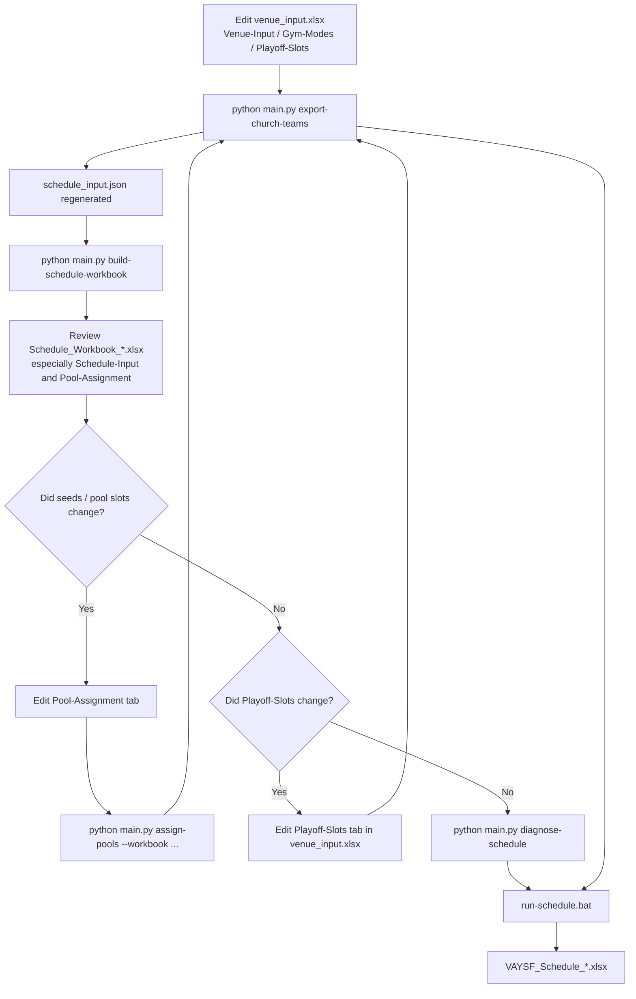

# How to Create the Sports Fest Competition Schedule

This is the **operator-facing** scheduling guide. It focuses on which Excel tab
to edit, which command to rerun, and where to look for the values needed by the
next step.

For the deeper architecture and JSON details, see
`docs/SCHEDULING.md`.

---

## Prerequisites

- `pip install -r requirements.txt` done
- `.env` configured with working API credentials
- Approved rosters available in WordPress / ChMeetings

---

## Mental model

The scheduling workflow has four important files:

- `venue_input.xlsx`
  This is where you edit booked courts, gym modes, and pinned playoff slots.
- `schedule_input.json`
  This is the machine contract used by the solver. It is regenerated by
  `export-church-teams`.
- `Schedule_Workbook_*.xlsx`
  This is the human-readable planning workbook. It is regenerated by
  `build-schedule-workbook` from `schedule_input.json`.
- `VAYSF_Schedule_*.xlsx`
  This is the final schedule workbook generated after solving.

The most important dependency to remember:

- `build-schedule-workbook` **reads** `schedule_input.json`
- it does **not** regenerate `schedule_input.json`

So after editing `venue_input.xlsx`, you usually rerun
`export-church-teams` first.

There are two different success levels:

- **Feasible schedule**: every required game can be placed legally.
- **Reasonable master schedule**: every game can be placed legally, and the
  result makes human sense for directors, athletes, and venue staff.

When a run fails or looks strange, treat the next step as a vector diagnosis
rather than a one-shot retry. The main vectors are demand, supply, gym modes,
pool assignment, fixed playoff pins, precedence, shared-athlete conflicts, and
quality preferences.

Use the diagnostic command any time you want a compact "what should I adjust
next?" report:

```text
python main.py diagnose-schedule
python main.py diagnose-schedule --output data/schedule_diagnostics.json
python main.py diagnose-schedule --input data/schedule_input.json --schedule-output data/schedule_output.json
```

The report summarizes game demand, resource supply, overlapping physical gym
mode windows, the Venue-Input/Gym-Modes resource contract, playoff pins,
precedence, gym allocation, unscheduled games, conflict audit status, and
next-action suggestions.

The resource contract section answers: did grouped physical venues flow through
Gym-Modes, did any direct venue rows bypass allocator coverage, and is any
physical gym exposed as more than one sport mode at the same time?

If a solved schedule is `OPTIMAL` or `FEASIBLE`, has zero unscheduled games,
and has no physical gym overlap warnings, gym-mode shortfalls are shown as
informational capacity notes. They mean the rough venue estimate is tight or
conservative, not that a game failed to schedule.

## Publishing To WordPress

`publish-schedule` is intentionally stricter than workbook rendering. It will
refuse to publish a `PARTIAL`, `INFEASIBLE`, `UNKNOWN`, or otherwise unscheduled
`schedule_output.json` by default, because WordPress is the event-day score
entry surface and should not silently receive an incomplete official schedule.

Use the normal flow only after diagnostics show the solve is complete:

```text
python main.py publish-schedule --dry-run
python main.py publish-schedule --execute
```

If leadership explicitly approves publishing an incomplete schedule during an
emergency, use `--allow-partial` so the audit trail records that decision:

```text
python main.py publish-schedule --dry-run --allow-partial
python main.py publish-schedule --execute --allow-partial
```

The command also fails closed if WordPress cannot return the existing published
schedule. A missing endpoint, auth failure, or server error must be fixed before
publishing so the diff is computed against a known state.

---

## Tab Status Map

Generated workbooks now include a status banner near the top-right of each
important tab. The banner is intentionally outside the data table so it does
not move headers or break imports.

Use this map when deciding whether to edit a sheet:

| Workbook | Tab | Status | What to do |
|----------|-----|--------|------------|
| `venue_input.xlsx` | `Venue-Input` | `EDITABLE INPUT` | Edit booked resource blocks here, then rerun `export-church-teams`. |
| `venue_input.xlsx` | `Gym-Modes` | `EDITABLE INPUT` | Edit physical gym mode capacities here. |
| `venue_input.xlsx` | `Playoff-Slots` | `EDITABLE OVERRIDE INPUT` | Optional playoff pins; pin by `gym_name` + `date` + `start_time` (preferred), or copy exact `resource_id` + `slot` values from `Schedule-Input`. |
| `Church_Team_Status_ALL_*.xlsx` | `Summary`, `Contacts-Status`, sport tabs | `READ-ONLY OUTPUT` | Review only; rerun `export-church-teams` after source data changes. |
| `Church_Team_Status_ALL_*.xlsx` | `Roster`, `Validation-Issues` | `GENERATED DATA SOURCE` | Scheduling reads these tabs; fix source data upstream instead of editing cells. |
| `Schedule_Workbook_*.xlsx` | `Summary`, `Pod-Divisions` | `READ-ONLY OUTPUT` | Generated planning context. |
| `Schedule_Workbook_*.xlsx` | `Venue-Estimator`, `Court-Schedule-Sketch` | `READ-ONLY PLANNING OUTPUT` | Use for planning; edit `venue_input.xlsx` for capacity changes. |
| `Schedule_Workbook_*.xlsx` | `Pod-Entries-Review` | `READ-ONLY REVIEW OUTPUT` | Review pod entries; fix roster/source data upstream. |
| `Schedule_Workbook_*.xlsx` | `Pod-Resource-Estimate` | `READ-ONLY CAPACITY CHECK` | Compare demand to venue capacity; edit `venue_input.xlsx` if capacity is wrong. |
| `Schedule_Workbook_*.xlsx` | `Schedule-Input` | `GENERATED LOOKUP / MACHINE CONTRACT VIEW` | Copy exact IDs and slots from here; do not hand-edit. |
| `Schedule_Workbook_*.xlsx` | `Pool-Assignment` | `TEMPORARY EDIT SURFACE` | Edit seeds/pool placements here, then rerun `assign-pools --workbook`. |
| `Schedule_Workbook_*.xlsx` | `Gym-Allocation` | `READ-ONLY ALLOCATION AUDIT` | Review gym-mode allocation; change venue inputs and rerun the workflow if needed. |
| `VAYSF_Schedule_*.xlsx` | `Schedule-by-Time`, `Schedule-by-Sport`, `Master-Schedule` | `FINAL OUTPUT` | Publish/review only; rerun the scheduler if inputs change. |
| `VAYSF_Schedule_*.xlsx` | `Conflict-Audit` | `AUDIT OUTPUT` | Check conflicts and warnings before publishing. |
| `VAYSF_Schedule_*.xlsx` | `Schedule-Diagnostics` | `DIAGNOSTIC OUTPUT` | Review the same next-action hints as `diagnose-schedule` without leaving Excel. |

---

## Workflow Map



---

## Step 1 - Fill Out `venue_input.xlsx`

Copy the template into the data folder:

```text
middleware/data/SportsFest_2026_Venue_Input_Template.xlsx
-> middleware/data/venue_input.xlsx
```

The file is gitignored. Do not commit it.

It has three main tabs:

### `Venue-Input`

One row per booked resource block.

Important columns:

| Column | Example | Notes |
|--------|---------|-------|
| `Pod Name` | `Basketball Pod` | Human planning label |
| `Venue Name` | `EHS Main Gym` | Human venue label shown in outputs |
| `Exclusive Venue Group` | `EHS Main Gym` | Use the same value for mutually exclusive gym-mode rows; leave blank for standalone direct rows |
| `Resource Type` | `Basketball Court` | Must match the canonical scheduler resource type |
| `Quantity` | `2` | Number of simultaneous courts/tables/fields in that row |
| `Date` | `7/26/2026` | Real calendar date; logical day labels are derived automatically |
| `Start Time` | `12` | First start hour (24h decimal) |
| `Last Start Time` | `17` | Last allowed start hour |
| `Slot Minutes` | `60` | Slot size for that resource |

Canonical resource type names:

- `Basketball Court`
- `Volleyball Court`
- `BC Station`
- `Soccer Field`
- `Badminton Court`
- `Pickleball Court`
- `Table Tennis Table`
- `Tennis Court`

Common human variants like `Jeopardy stage`, `Soccer field`, and
`Table Tennis station` are normalized automatically, but using the canonical
names directly is still best.

### `Gym-Modes`

One row per physical gym that can switch modes.

Use this only for allocator-managed gyms. If you want to reserve a specific
Sunday finals block directly, add a direct `Venue-Input` row with a blank
`Exclusive Venue Group`.

### `Playoff-Slots`

One row per pinned playoff game.

Required columns:

| Column | Meaning |
|--------|---------|
| `game_id` | Exact game ID from `Schedule-Input -> GAMES` |
| `event` | Exact event name from `Schedule-Input -> GAMES` |
| `stage` | `QF`, `Semi`, `Final`, or `3rd` |

Then pick **one** placement form per row:

**Venue-centric (preferred — no internal IDs needed):**

| Column | Meaning |
|--------|---------|
| `gym_name` | The venue as written in `Venue-Input` (`Venue Name` or `Exclusive Venue Group`) |
| `date` | A date that appears in `Venue-Input` (a day label like `Sun-2` also works) |
| `start_time` | `HH:MM`, inside that venue's `Venue-Input` window |
| `slot_minutes` | Optional synthetic-resource grid size; defaults to the venue row's slot size |

The build resolves the venue to a concrete resource automatically and, for
allocator-managed gyms, reserves the pinned window so regular pool-play games
can never claim it. Invalid pins abort generation instead of being omitted.
The error lists unknown venues/windows, gym-mode conflicts, court-count
overflow, or overlapping multi-slot pins; fix the rows and re-run
`export-church-teams`.

**Explicit (override / legacy):**

| Column | Meaning |
|--------|---------|
| `resource_id` | Exact resource ID from `Schedule-Input -> RESOURCES` |
| `slot` | `Day-HH:MM`, for example `Sun-2-14:00` |

Important:

- `resource_id` is **not always `GYM-*`**
- allocator-managed gym blocks often use `GYM-*`
- direct standalone rows often use prefixes like `BB-*`, `VB-*`, `BC-*`,
  `SOC-*`, `BAD-*`, `PCK-*`, `TT-*`, `TEN-*`
- generated resource ordinals can **drift** when `Venue-Input` changes; if
  you use the explicit form, refresh `resource_id` values from the newest
  `Schedule-Input -> RESOURCES` after every venue edit (the venue-centric
  form avoids this entirely)
- when a row carries both forms, the explicit `resource_id` + `slot` wins
- if a pinned row uses a `game_id` that already exists in the modeled
  `Schedule-Input -> GAMES` list, that pinned row **replaces** the modeled
  assignment for that game in the final schedule output
- if a pinned row uses a `game_id` that is not modeled in `games`, it is kept
  as a manual playoff-only assignment

The authoritative source is always the generated `Schedule-Input` tab.

---

## Step 2 - Generate `schedule_input.json`

After editing `venue_input.xlsx`, run:

```bash
cd middleware
python main.py export-church-teams
```

This does two things:

- refreshes the church/team export workbooks
- regenerates `schedule_input.json` using the current venue and pool inputs

If `venue_input.xlsx` changed, this step is usually required before
`build-schedule-workbook`.

---

## Step 3 - Build the Planning Workbook

Run:

```bash
python main.py build-schedule-workbook
```

This regenerates `Schedule_Workbook_*.xlsx` from the current
`schedule_input.json`.

The most important tab for operator workflow is:

- `Schedule-Input`

Use it as your lookup sheet:

- `GAMES` section gives exact `game_id`, `event`, and `stage`
- `RESOURCES` section gives exact `resource_id`, `day`, `open_time`,
  `close_time`, and `slot_minutes`

This is the safest place to copy values for `Playoff-Slots`.

### How to read `Venue-Estimator`

Two columns matter a lot during venue planning:

- `Estimating Teams/Entries`
  This is the **operational count** used for the current schedule build.
  It reflects the complete teams / entries the pipeline can schedule now.
- `Potential Teams/Entries`
  This is a **capacity-planning ceiling**, not the default scheduling count.
  For racquet sports, it is rule-aware: it uses current registrations,
  includes incomplete doubles pairing where relevant, and caps the total using
  the 2026 church entry limits.

Use `Estimating Teams/Entries` for the schedule you generate today.
Use `Potential Teams/Entries` to judge whether your booked venue still has
enough headroom if more partial racquet registrations finish later.

---

## Step 4 - Optional Seed / Pool Editing

If you edit the `Pool-Assignment` tab in `Schedule_Workbook_*.xlsx`, run:

```bash
python main.py assign-pools --workbook path/to/Schedule_Workbook_YYYY-MM-DD.xlsx
```

That updates the workbook and writes `pool_assignments.json`.

Then rerun:

```bash
python main.py export-church-teams
python main.py build-schedule-workbook
```

Reason:

- `assign-pools` updates the Excel-side seed/draw state
- `export-church-teams` pulls that sidecar state back into
  `schedule_input.json`
- `build-schedule-workbook` lets you inspect the refreshed machine contract

If you did **not** change `Pool-Assignment`, you can skip `assign-pools`.

---

## Step 4A - 2026 Manual Team-Sport Matchup Import

For the 2026 event, team-sport pool games may use meeting-approved manual
matchups instead of the generated `Pool-Assignment` pairings.

This workflow is implemented by `import-team-matchups`, which validates the
approved workbook and writes `manual_team_matchups.json` for
`export-church-teams` to consume.

The approved workbook lives in:

```text
middleware/data/2026-VAY-Lottery-Drawing_Team-Assignment(ALL-TEAM-SPORTS)_template.xlsx
```

The 2026 active imported worksheets are:

| Worksheet | Event | Notes |
|-----------|-------|-------|
| `BB_round2` | Basketball - Men Team | Current Basketball source of truth, updated 2026-06-25 |
| `MVB` | Volleyball - Men Team | Men's Volleyball source of truth, updated 2026-06-21 |
| `WVB` | Volleyball - Women Team | Women's Volleyball source of truth, updated 2026-06-21 |
| `SOC` | Soccer - Coed Exhibition | Two-team Soccer matchups; imported when populated |
| `BC` | Bible Challenge - Mixed Team | Three-team Bible Challenge triplets; imported when populated |

Run the import step:

```bash
python main.py import-team-matchups
```

By default, this reads the approved workbook from `middleware/data/` and writes
`manual_team_matchups.json` to the normal export folder. If you are using a
custom workbook or export folder, pass the paths explicitly:

```bash
python main.py import-team-matchups --file path/to/manual_matchups.xlsx
python main.py import-team-matchups --output path/to/manual_team_matchups.json
python main.py export-church-teams --output path/to
```

If you need to re-import the older BB/MVB/WVB-only workbook, select only those
worksheets:

```bash
python main.py import-team-matchups --sheet BB_round2 --sheet MVB --sheet WVB
```

Then continue with:

```bash
python main.py export-church-teams
python main.py build-schedule-workbook
python main.py diagnose-schedule
run-schedule.bat
```

What changes in this mode:

- the manual matchup workbook is the source of truth for any populated imported
  team-sport worksheet
- pool roster / slot maps are optional when the matchup list has the required
  slot numbers and team codes; imported games keep `pool_id` blank when no pool
  map is provided
- `bye` rows are skipped as non-games
- WVB's 4-games-per-team matchup list is accepted as imported fixed games
- you do **not** need to change `COURT_ESTIMATE_POOL_GAMES_VOLLEYBALL_WOMEN`
  to `4`
- BC rows contain three teams per game and create the normal BC semi/final
  placeholders after imported round-robin games
- BC does not operate by pools; its manual tab is expected to behave as one
  global Jeopardy queue
- `Pool-Assignment` should not be used to change pairings for events imported
  from the manual workbook
- `Pool-Assignment` still applies to sports that remain on the generated
  assignment path

Before solving, inspect `Schedule_Workbook_*.xlsx -> Schedule-Input` and make
sure the imported games match the approved workbook.

---

## Step 4B - 2026 Main Schedule Workbook Override

The 2026 main schedule workbook is an operator-authored allocation plan. It is
not the roster source and it is not the matchup source. It tells the scheduler
where and when already-known games should land.

The workbook currently lives in:

```text
middleware/data/VAY2026_Main_Schedule_draft_4.xlsx
```

Run the import step after the matchup import and before the next
`export-church-teams` run:

```bash
python main.py import-master-schedule --file "data/VAY2026_Main_Schedule_draft_4.xlsx"
```

By default, this writes `manual_schedule_overrides.json` to the normal export
folder. To validate against a specific `schedule_input.json` or write a custom
sidecar path:

```bash
python main.py import-master-schedule \
  --file "data/VAY2026_Main_Schedule_draft_4.xlsx" \
  --schedule-input path/to/schedule_input.json \
  --output path/to/manual_schedule_overrides.json
```

What changes in this mode:

- parsed workbook rows are classified as numbered games, playoff/stage games,
  Bible Challenge three-team games, or broad manual blocks
- confidently resolved rows are merged into `schedule_input.json` as fixed
  assignments using the existing `playoff_slots` mechanism
- unresolved rows are logged and kept in the sidecar for comparison; they are
  not guessed into another court or time
- duplicate fixed-game or duplicate fixed-slot conflicts fail the import/export
  so the operator can fix the workbook or venue inputs
- `manual_team_matchups.json` remains the source of truth for team pairings
- roster/registration data still comes from ChMeetings and WordPress

Recommended 2026 override loop:

```bash
python main.py import-team-matchups --file "data/2026-VAY-Lottery-Drawing_Team-Assignment(ALL-TEAM-SPORTS)_template.xlsx"
python main.py import-master-schedule --file "data/VAY2026_Main_Schedule_draft_4.xlsx"
python main.py export-church-teams
python main.py build-schedule-workbook
python main.py diagnose-schedule
run-schedule.bat
```

If `import-master-schedule` says a row is unresolved, treat it as a comparison
finding between the manual schedule and the current system model. Common causes
are a manual game ID that does not exist in `schedule_input.json`, a court/time
that is not available in `venue_input.xlsx`, or a visual lane count that differs
from the current generated resources.

---

## Step 4C - 2026 Visual Match Schedule Team-Code Overrides (BB/MVB/WVB)

A second, related workbook — the one Loc (the human Sports Fest scheduler)
fills in by hand with the real team codes for every Basketball, Men's
Volleyball, and Women's Volleyball slot — is a different source from Step 4B's
workbook, even though it looks like the same visual grid. Step 4B pins an
already-known game to a time/court; this step specifies *which teams are
playing* in each slot, and that pairing is authoritative.

The workbook currently lives in:

```text
middleware/data/2026 Main Schedule draft 11.xlsx
```

Always start with a dry run so you can review the audit before anything is
written:

```bash
python main.py import-match-schedule-overrides --file "data/2026 Main Schedule draft 11.xlsx" --events BB,MVB,WVB --dry-run
```

The dry run writes `match_schedule_overrides.audit.json` to the normal export
folder and never touches `match_schedule_overrides.json` or
`schedule_input.json`. Once the audit is clean (or the remaining errors are
understood), commit it:

```bash
python main.py import-match-schedule-overrides --file "data/2026 Main Schedule draft 11.xlsx" --events BB,MVB,WVB --execute
```

`--execute` only writes `match_schedule_overrides.json` when validation has
zero errors — a run with errors makes no changes.

What changes in this mode:

- team codes are validated against the current roster; an unknown code, or a
  code registered for a different event, is a hard error naming the sheet
  cell and the actual event the code belongs to
- a pairing that matches an already-generated pool game gets its time/court
  pinned, using the same fixed-slot mechanism as Step 4B
- a pairing with no existing match is created from the visual schedule (this
  is logged as a warning, with full provenance, not applied silently)
- a team double-booked at the same slot within the same event is a hard
  error; the same church code appearing in both an MVB slot and a WVB slot at
  the same time is not flagged, since those are different rosters of players
- `manual_team_matchups.json` and `manual_schedule_overrides.json` are
  unaffected — this is a third, independent sidecar

Recommended 2026 override loop:

```bash
python main.py import-team-matchups --file "data/2026-VAY-Lottery-Drawing_Team-Assignment(ALL-TEAM-SPORTS)_template.xlsx"
python main.py import-match-schedule-overrides --file "data/2026 Main Schedule draft 11.xlsx" --events BB,MVB,WVB --dry-run
python main.py import-match-schedule-overrides --file "data/2026 Main Schedule draft 11.xlsx" --events BB,MVB,WVB --execute
python main.py export-church-teams
python main.py build-schedule-workbook
python main.py diagnose-schedule
run-schedule.bat
```

If the audit reports a "no matching generated pool game" warning for a
pairing you expected to already exist, run `import-team-matchups` (or
`assign-pools`) first and re-import — that usually means the pool draw
hasn't been imported yet, not that the visual schedule is wrong.

---

## Step 5 - Fill `Playoff-Slots`

After `build-schedule-workbook`, open `Schedule_Workbook_*.xlsx` and use
`Schedule-Input` as the source of truth.

### Where each value comes from

| `Playoff-Slots` column | Where to look |
|------------------------|---------------|
| `game_id` | `Schedule-Input -> GAMES` |
| `event` | `Schedule-Input -> GAMES` |
| `stage` | `Schedule-Input -> GAMES` |
| `gym_name` (preferred form) | `Venue-Input` — `Venue Name` or `Exclusive Venue Group` |
| `date` (preferred form) | `Venue-Input` — the booked date |
| `start_time` (preferred form) | Any time inside that venue's window |
| `resource_id` (explicit form) | `Schedule-Input -> RESOURCES` |
| `slot` (explicit form) | Build from the resource `day` plus the desired time |

Example:

If the `RESOURCES` section contains:

```text
BB-Sun-2-3 | Basketball Court | Court-1 | Sun-2 | 12:00 | 18:00 | 60
```

then valid pinned slot values include:

```text
Sun-2-12:00
Sun-2-13:00
Sun-2-14:00
Sun-2-15:00
Sun-2-16:00
Sun-2-17:00
```

### Override behavior

`Playoff-Slots` is authoritative for game timing.

- If the `game_id` already exists in `Schedule-Input -> GAMES`, the pinned
  row overrides the solver's modeled placement for that game.
- If the `game_id` does not exist in `GAMES`, the pinned row is carried
  through as a manual playoff-only assignment.

This is why you can move a generated final like `BC-Final` to a fixed Sunday
slot without deleting it from the modeled game list first.

### Logical day labels

The system now uses weekday-aware day keys such as:

- `Fri-1`
- `Sat-1`
- `Sun-1`
- `Sat-2`
- `Sun-2`

These are derived automatically from the real calendar dates in `Venue-Input`.

### Racquet / pod playoff IDs

Racquet brackets expose stable late-round IDs in
`Schedule-Input -> GAMES`, including `QF`, `Semi`, `Final`, and `3rd` when
the configured bracket supports those rounds. Larger brackets keep numeric
IDs for early rounds and then transition to the named late-round IDs.

Use these exact IDs in `Playoff-Slots`; the solver preserves round precedence
and waits for each prior-round game to finish before starting the next round.

---

## Step 6 - Regenerate After Editing `Playoff-Slots`

After changing `Playoff-Slots`, rerun:

```bash
python main.py export-church-teams
```

This is the step that writes the pinned playoff rows back into
`schedule_input.json`.

If you want to inspect the refreshed machine contract first, also rerun:

```bash
python main.py build-schedule-workbook
```

---

## Step 7 - Solve and Render

For the normal full run:

```bat
run-schedule.bat
```

That runs:

- `solve-schedule`
- `produce-schedule`

and writes:

- `VAYSF_Schedule_YYYY-MM-DD.xlsx`

Key tabs:

- `Schedule-by-Time`
- `Schedule-by-Sport`
- `Conflict-Audit`

---

## Which Command Do I Rerun?

This is the most important operator table.

| What changed? | What to rerun |
|---------------|---------------|
| `Venue-Input` or `Gym-Modes` | `export-church-teams`, then `build-schedule-workbook` |
| `Pool-Assignment` seeds / slots | `assign-pools`, then `export-church-teams`, then `build-schedule-workbook` |
| 2026 manual team-sport matchup workbook | `import-team-matchups`, then `export-church-teams`, `build-schedule-workbook`, `diagnose-schedule`, and `run-schedule.bat` |
| 2026 main schedule workbook | `import-master-schedule`, then `export-church-teams`, `build-schedule-workbook`, `diagnose-schedule`, and `run-schedule.bat` |
| 2026 visual match schedule team codes (BB/MVB/WVB) | `import-match-schedule-overrides --dry-run`, review, then `--execute`, then `export-church-teams`, `build-schedule-workbook`, `diagnose-schedule`, and `run-schedule.bat` |
| `Playoff-Slots` only | `export-church-teams`, then `run-schedule.bat` |
| Want to inspect IDs before solving | `build-schedule-workbook` |
| Roster / registrations changed upstream | `export-church-teams`, then `build-schedule-workbook`, then `run-schedule.bat` |

Safe rule of thumb:

- if `venue_input.xlsx` changed, rerun `export-church-teams`
- if you need to see IDs or games, rerun `build-schedule-workbook`
- if scheduleable games or resources changed, rerun `run-schedule.bat`

---

## Recommended Operator Loops

### Loop A - Venue / court planning

Use this after editing `Venue-Input` or `Gym-Modes`:

```bash
python main.py export-church-teams
python main.py build-schedule-workbook
```

Then review `Schedule-Input`.

### Loop B - Seed / pool planning

Use this after editing `Pool-Assignment`:

```bash
python main.py assign-pools --workbook path/to/Schedule_Workbook_YYYY-MM-DD.xlsx
python main.py export-church-teams
python main.py build-schedule-workbook
```

### Loop C - Final playoff pinning

Use this after editing `Playoff-Slots`:

```bash
python main.py export-church-teams
run-schedule.bat
```

If you want to double-check the IDs after those edits:

```bash
python main.py build-schedule-workbook
```

---

## Quick Checklist

- [ ] `venue_input.xlsx` updated
- [ ] `export-church-teams` run after venue edits
- [ ] `build-schedule-workbook` used to inspect `Schedule-Input`
- [ ] `assign-pools` run only if `Pool-Assignment` changed
- [ ] `Playoff-Slots` copied from exact generated IDs, not guessed
- [ ] `export-church-teams` run again after `Playoff-Slots` edits
- [ ] `run-schedule.bat` completed successfully
- [ ] final `VAYSF_Schedule_*.xlsx` reviewed before publishing
